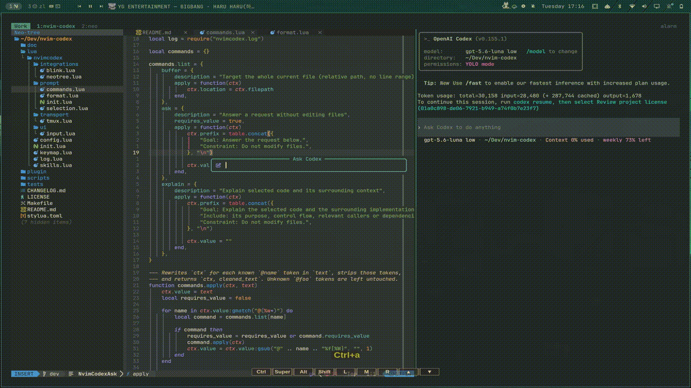
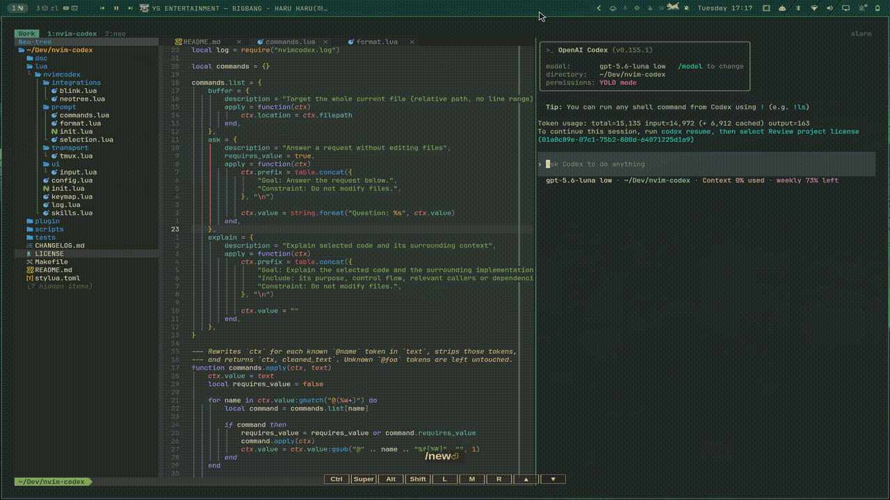

# nvim-codex

`nvim-codex` sends your current line or Visual selection, with its file
location, to an open [Codex CLI](https://github.com/openai/codex) session in
tmux. Write a request in Neovim and send it to the matching Codex pane without
copying code or file paths by hand.

## Requirements

- Neovim 0.10.1 or later
- [snacks.nvim](https://github.com/folke/snacks.nvim)
- [tmux](https://github.com/tmux/tmux)
- [Codex CLI](https://github.com/openai/codex), running in a tmux pane
- [blink.cmp](https://github.com/Saghen/blink.cmp) (optional, for prompt completion)

Neovim and Codex must be in the same tmux window. The Codex pane must be
running in the same working directory as Neovim. The plugin finds panes by
their current command (`codex`) and current directory.

## Installation

With [lazy.nvim](https://github.com/folke/lazy.nvim):

```lua
{
  "neoju/nvim-codex",
  dependencies = {
    "folke/snacks.nvim",
    "saghen/blink.cmp", -- optional, for prompt completion
  },
}
```

With [packer.nvim](https://github.com/wbthomason/packer.nvim):

```lua
use({
  "neoju/nvim-codex",
  requires = {
    "folke/snacks.nvim",
    "saghen/blink.cmp", -- optional, for prompt completion
  },
  config = function()
    require("nvimcodex").setup()
  end,
})
```

## Usage

1. Start Neovim and Codex in separate panes of the same tmux window, both in
   the project directory.
2. In Neovim, place the cursor on a line or select lines in Visual mode.
3. Press `<C-a>` and enter your request.
4. The plugin writes a prompt such as `lua/nvimcodex/init.lua:L35 - explain
this function` into the Codex pane.
5. By default, the plugin submits the prompt automatically. Set `auto_send` to
   `false` if you want to press `<Enter>` in Codex yourself, and enable
   `auto_focus_codex` if you also want to switch focus to the Codex pane.

In Normal mode, the current line is sent. In Visual mode, the selected line
range is sent. The plugin uses `Snacks.input()` for prompts; `snacks.nvim` is a
required dependency.

If no matching Codex pane is found, the plugin shows a warning. Check that
Codex is running, that both panes share a tmux window, and that their working
directories match.

### Examples

Send the current line from Normal mode:



Send code with the current file context:



Use the current buffer and include a skill in the prompt:


Use the ask and explain completion entries:


## Configuration

With LazyVim, add `lua/plugins/nvim-codex.lua`:

```lua
return {
  "neoju/nvim-codex",
  dependencies = {
    "folke/snacks.nvim",
    "saghen/blink.cmp", -- optional, for prompt completion
  },
  opts = {
    debug = false,
    auto_send = true,
    auto_focus_codex = false,
    keymap = "<C-a>",
  },
}
```

Available options:

- `debug`: Set to `true` to enable diagnostic notifications. Defaults to
  `false`.
- `auto_send`: Press `<Enter>` in the Codex pane after sending the prompt.
  Defaults to `true`.
- `auto_focus_codex`: Focus the Codex pane after sending the prompt. Defaults
  to `false`.
- `keymap`: Normal/Visual mode mapping that opens the prompt. Defaults to
  `"<C-a>"`; set to `false` to disable the mapping.

## Completion

If [blink.cmp](https://github.com/Saghen/blink.cmp) is installed, completion is
registered automatically for the prompt. Available entries are:

| Entry | Purpose |
| --- | --- |
| `$<skill>` | Include a Codex skill. Project skills take precedence over user and plugin skills. |
| `@buffer` | Target the current file, without a line range. |
| `@ask` | Ask Codex to answer without editing files. |
| `@explain` | Ask Codex to explain the selected code and its surrounding context. |
| `#scoped` | Attach an edit boundary to the current task. |

Command definitions live in `lua/nvimcodex/prompt/definitions/commands/` and
modifier definitions in `lua/nvimcodex/prompt/definitions/modifiers/`, one
Markdown file per entry. The filename is its token name. Header values use JSON
strings or booleans. The four prompt attributes are `primary_goal`,
`primary_context`, `primary_output`, and `primary_boundaries`. A command may
also put special instructions after the closing `---`. They appear as
`General: <text>` before the four attributes in the sent prompt. The four
attributes take priority if they conflict with General.
For multiline special instructions, continuation lines are indented under
`General:` so they stay distinct from the four attributes.
Modifiers may set only the four prompt attributes, plus description and usage
metadata; they cannot add special instructions. A modifier's attribute replaces
the corresponding command attribute.

```markdown
---
des: "Answer a request without editing files"
primary_goal: "Answer the user's question."
primary_output: "A direct answer."
primary_boundaries: "Do not modify files."
---
Explain the reasoning when it helps.
```

Sent prompts place the four attributes, `$skill` tokens, and file context in
an `<INSTRUCTIONS>` block, followed by the request in a `<USER_PROMPT>` block.
Each `@name` starts a task. Each `#name` attaches a modifier to the current
task without starting another task. For example, `@buffer #scoped`
targets the current file and limits edits to it. A `#name` before the first
command attaches to the first task. Separate tasks include guidance to run
non-conflicting work in parallel and consider separate worktrees for concurrent
edits.
Each `$skill` applies to the task command before it, or to the first task if it
appears before any task command.
The command parser always returns a task list, including for a plain request;
the formatter renders either one task or several from that list.

Skills are loaded when the prompt first opens and refreshed after `DirChanged`.
To rescan them manually, run `:lua require("nvimcodex").reload_skills()`.

If automatic registration does not work with your blink.cmp setup, add this
LazyVim plugin spec to `lua/plugins/blink.lua`:

```lua
return {
  "saghen/blink.cmp",
  opts = {
    sources = {
      per_filetype = {
        nvimcodex_ask = { "nvimcodex" },
      },
      providers = {
        nvimcodex = {
          name = "NvimCodex",
          module = "nvimcodex.integrations.blink",
        },
      },
    },
  },
}
```

## Commands and API

`:Nvimcodex` opens the prompt. The public Lua API is also available through
`require("nvimcodex")`:

```lua
local codex = require("nvimcodex")

codex.setup()
codex.send()
codex.reload_skills()
```

Run `:help Nvimcodex.options` for the generated option documentation.

## Contributing

Run the test suite with:

```sh
make test
```

Please include a focused description and reproduction steps with bug reports.

## License

[MIT](LICENSE)
